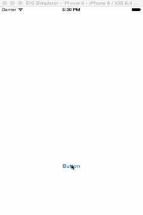

# ATAlertView
Custom gesture base easy to use alert view for iOS written in Swift.



## Installation
**Manually from GitHub**

1.	Download the file named `ATAlertView.swift`.
2.	Add the source file to your Xcode project (drag and drop is easiest).

## Usage Example
```swift
alert = ATAlertView()
alert.delegate = self
alert.showAlertToView(self.view,title: "Sample Title", 
                                message: "Sample message Sample message Sample message", 
                                cancelButtonTitle: "Ok", 
                                otherButtonTitle: nil,  
                                presentaitonStyle: ATAlertViewPresentationStyle.HardDown, 
                                dismissStyle: ATAlertViewDismissStyle.HardUp)
                                
// By default gestures are on and default geture will be UIPanGesture but you can change it to tap or turn it off
alert.isGestureModeEnable = false;
alert.alertDismissGesture = ATAlertViewGestureType.Tap

// Customise Alrt and background overlay
alert.titleColor             = UIColor.whiteColor()
alert.messageColor           = UIColor.whiteColor()
alert.backgroundColor        = UIColor.redColor();
alert.overlayBackgroundColor = UIColor.blueColor()

```


### Delegate `ATAlertviewDelegate`

Implement the following delegate method for tracking of alert button taps
```swift
func didTapButonAtIndex(index: NSInteger, buttonTitle: String) {
        
        // You logic here
    }
  ```
  
## Issues & Contributions
Please [open an issue here on GitHub](https://github.com/tanveer-ashraf/ATAlertView/issues/new) if you have a problem, suggestion, or other comment.

Pull requests are welcome and encouraged! There are no official guidelines, but please try to be consistent with the existing code style.

## License
ATAlertView is provided under the MIT license.
